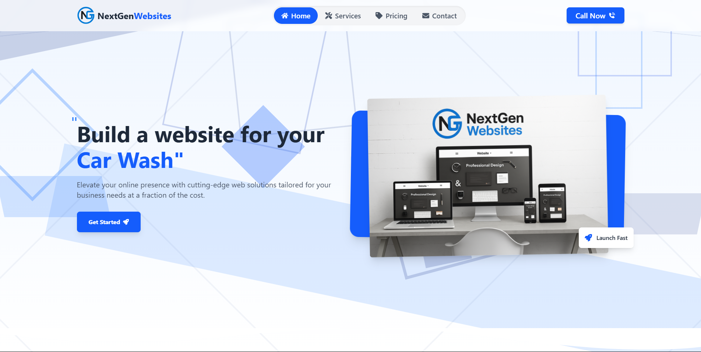
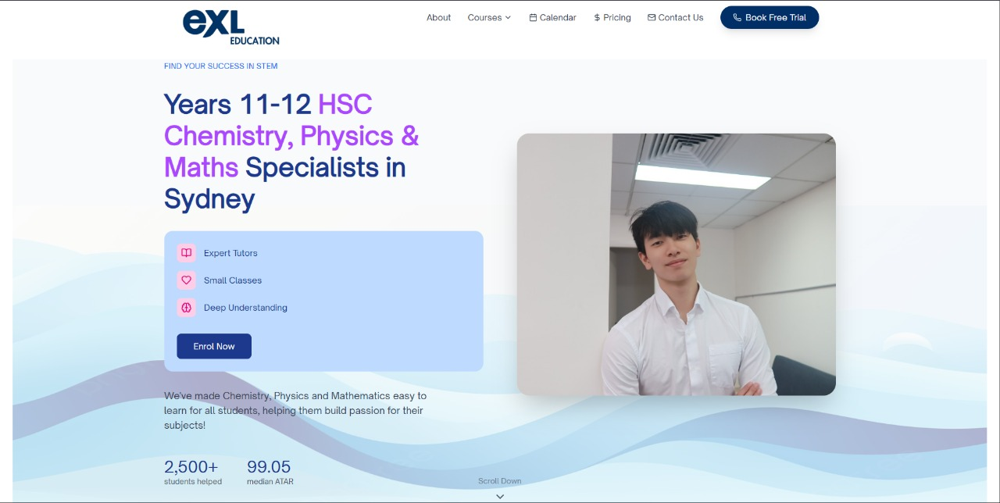
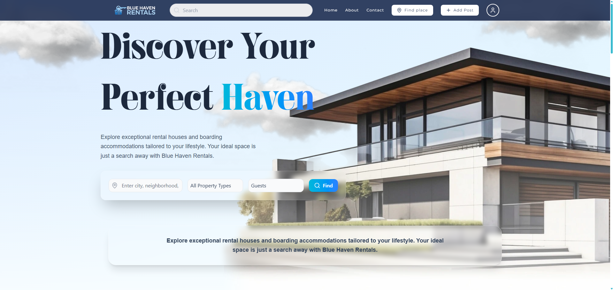
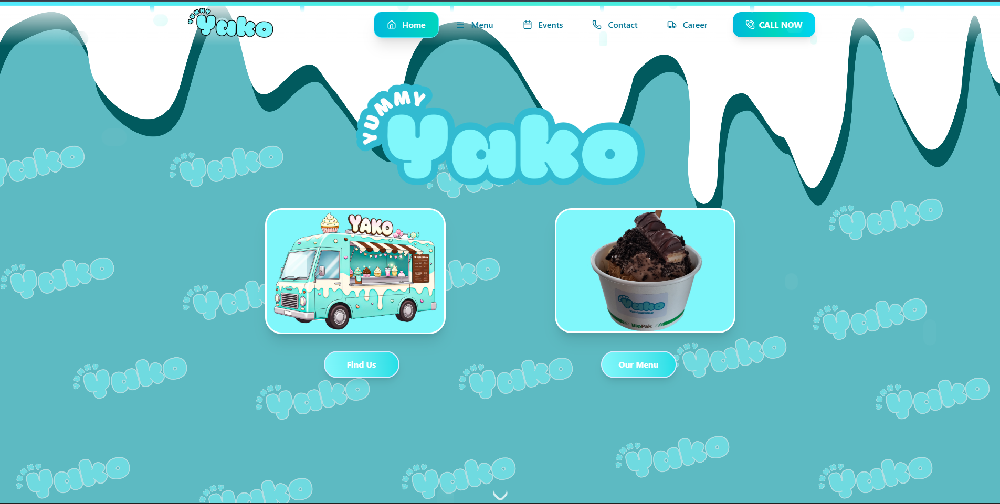
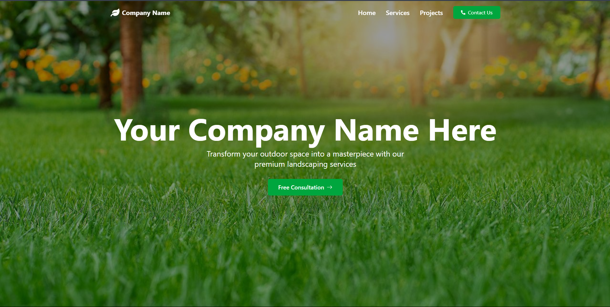
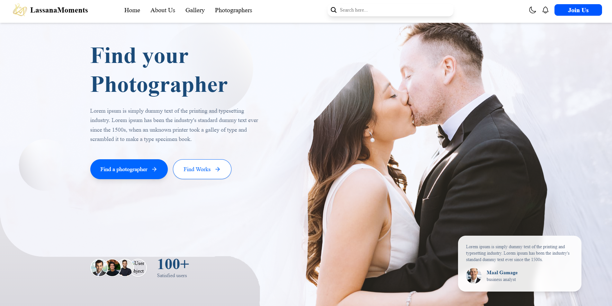
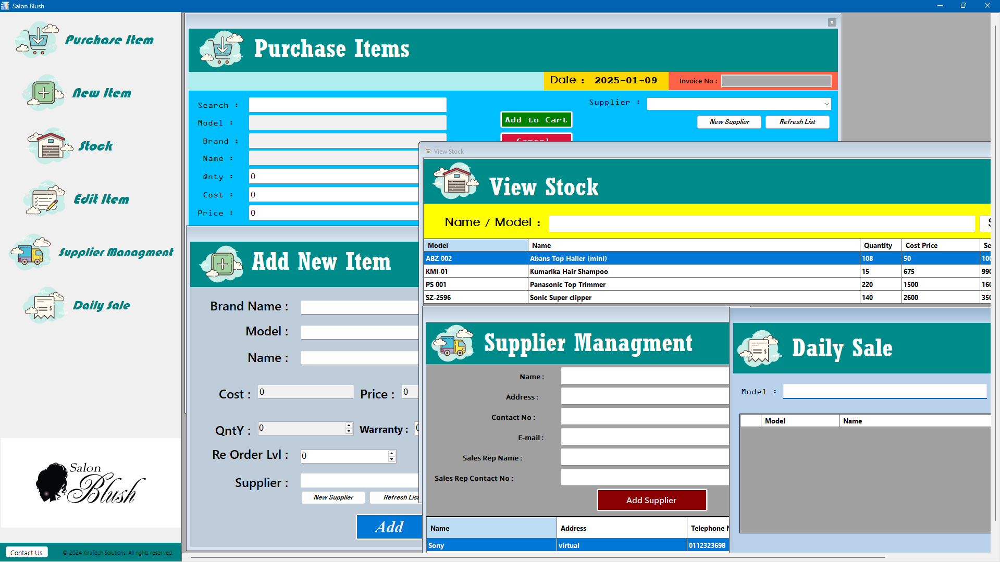
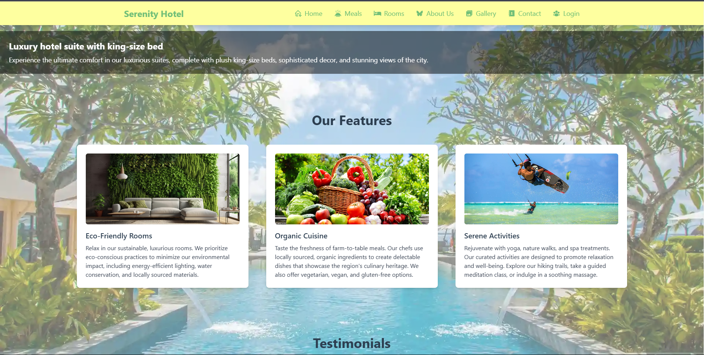
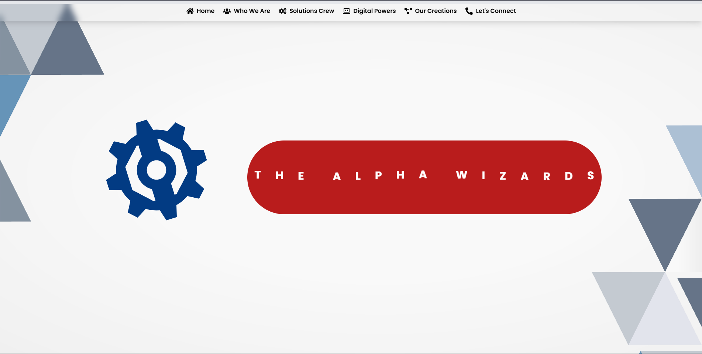
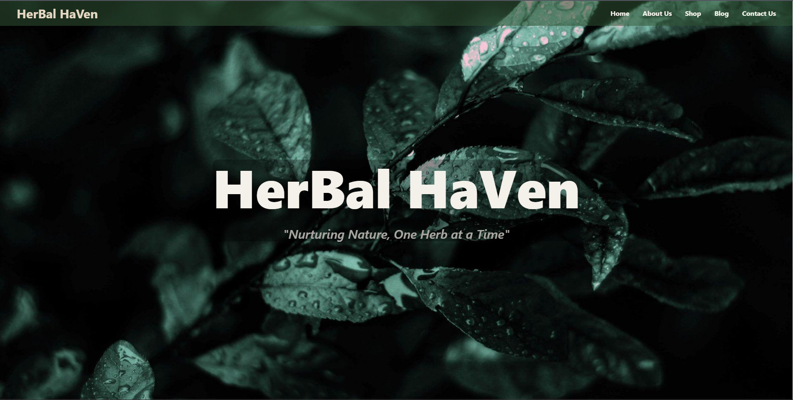

# Projects

Crafting digital experiences that blend **innovation** with functionality. Each project tells a story of problem-solving and creative execution.

---

## Featured Projects

### Nebula Arcs {#nebula-arcs}

{ .project-image }

**Category**: Digital Agency Site | **Year**: 2025

A sleek digital agency website showcasing services in web development, SEO, digital marketing, and AI video production for global clients.

**Technologies**: ReactJS, NextJS, Tailwind CSS, Framer Motion

**Status**: LIVE

**Live Site**: [nebulaarcs.com](https://nebulaarcs.com/){:target="\_blank"}

**Stats**: 3.2K Views | 1.1K Users | 4.9 Rating

---

### Sparkling Car Care {#sparkling-car-care}

{ .project-image }

**Category**: Business Website | **Year**: 2025

Premium auto detailing service platform with booking system and payment integration.

**Technologies**: React, Tailwind CSS

**Status**: LIVE

**Live Site**: [sparklingcarcare.com.au](https://www.sparklingcarcare.com.au/){:target="\_blank"}

**Stats**: 1.8K Views | 14.2K Users | 4.9 Rating

---

### NextGen Websites

{ .project-image }

**Category**: Business Website

Affordable and professional web development services for businesses worldwide.

**Technologies**: ReactJS, Tailwind CSS

**Status**: LIVE

**Live Site**: [nextgenwebsites.info](https://www.nextgenwebsites.info/){:target="\_blank"}

---

### EXL Education {#exl-education}

{ .project-image }

**Category**: Web Platform | **Year**: 2025

A modern educational platform offering curated resources, tutorials, and tools to support student learning in Australia.

**Technologies**: React, Tailwind CSS

**Status**: LIVE

**Live Site**: [exleducation.com.au](https://exleducation.com.au/){:target="\_blank"}

**Stats**: 1.9K Views | 16.5K Users | 4.7 Rating

---

### Blue Heaven Rentals {#blue-heaven-rentals}

{ .project-image }

**Category**: Academic Project | **Year**: 2024

Blue Heaven Rentals is a university 2nd year group project developed as part of our degree program, focused on simplifying and modernizing the property rental process. The web application is designed to help users easily browse, search, and explore rental properties, while enabling property owners or admins to manage listings efficiently. The project is built using React for a fast and interactive user interface, Tailwind CSS for a clean and responsive design, and Firebase for authentication and real-time data handling. As a collaborative academic project, Blue Heaven Rentals addresses real-world rental management challenges while demonstrating strong teamwork, practical problem-solving, and full-stack web development skills.

**Technologies**: React, Tailwind CSS, Firebase

**Status**: LIVE

**Live Site**: [bluehavenrentals.netlify.app](https://bluehavenrentals.netlify.app/){:target="\_blank"}

---

## Client Projects

### NextGen Websites

Affordable and professional web development services for businesses worldwide.

**Technologies**: ReactJS, Tailwind CSS

**Live Site**: [nextgenwebsites.info](https://www.nextgenwebsites.info/){:target="\_blank"}

---

### Sparkling Car Care

Premium auto detailing service platform with booking system and payment integration.

**Technologies**: ReactJS, Tailwind CSS

**Live Site**: [sparklingcarcare.com.au](https://www.sparklingcarcare.com.au/){:target="\_blank"}

---

### Nebula Arcs

A sleek digital agency website showcasing services in web development, SEO, digital marketing, and AI video production for global clients.

**Technologies**: ReactJS, NextJS, Tailwind CSS, Framer Motion

**Live Site**: [nebulaarcs.com](https://nebulaarcs.com/){:target="\_blank"}

---

### Yummy Yako

{ .project-image }

A dessert food truck website highlighting delicious treats, menu browsing, and an engaging user experience with smooth animations.

**Technologies**: ReactJS, Tailwind CSS, Framer Motion

**Live Site**: [yummyyako.netlify.app](https://yummyyako.netlify.app/){:target="\_blank"}

---

### Study Mate

{ .project-image }

A smart task management platform built for students to organize assignments, lectures, and exams with real-time syncing via Firebase.

**Technologies**: ReactJS, Tailwind CSS, Firebase, Framer Motion

**Live Site**: [smtaskmanager.netlify.app](https://smtaskmanager.netlify.app/){:target="\_blank"}

---

### BusMate LK

{ .project-image }

Real-time web application helping Sri Lankan commuters plan efficient bus routes and track availability.

**Technologies**: ReactJS, Firebase, Framer Motion, Tailwind CSS

**Live Site**: [busmatelk.netlify.app](https://busmatelk.netlify.app/){:target="\_blank"}

---

### AI Write Checker

{ .project-image }

Free and reliable AI content detection tool to verify authenticity of written text.

**Technologies**: ReactJS, Firebase, AI API

**Live Site**: [aiwritechecker.netlify.app](https://aiwritechecker.netlify.app/){:target="\_blank"}

---

### Gardenin Template

{ .project-image }

A beautifully designed and responsive gardening website template for landscapers and garden service providers.

**Technologies**: ReactJS, Tailwind CSS

**Live Site**: [gardenintemplate.netlify.app](https://gardenintemplate.netlify.app/){:target="\_blank"}

---

## Template Projects

### Job Portal Design

{ .project-image }

Advanced job portal with sophisticated UI/UX implementations and modern design patterns.

**Technologies**: React, Node.js, MongoDB, Express

**Live Site**: [jobportaltest.netlify.app](https://jobportaltest.netlify.app/){:target="\_blank"}

---

### Sandaru Aqua

{ .project-image }

Advanced water purification solutions with innovative design and maintenance services.

**Technologies**: React, Node.js, Firebase

**Live Site**: [sandaruaqua.netlify.app](https://sandaruaqua.netlify.app/){:target="\_blank"}

---

### Lassana Moments

{ .project-image }

Full-Stack ongoing group project as Head Front-End Developer.

**Technologies**: React, Node.js, Firebase

**Live Site**: [lassanamomentz.netlify.app](https://lassanamomentz.netlify.app/){:target="\_blank"}

---

### Salon IMS

{ .project-image }

Salon Inventory Management System simplifies and optimizes inventory management for salon operations.

**Technologies**: C#, MySQL

**Source Code**: [GitHub Repository](https://github.com/Werosh/Salon-Inventory-System-Uni-Assinment.git){:target="\_blank"}

---

### Alphawizards Portfolio

{ .project-image }

Personal portfolio platform with advanced UI/UX implementations.

**Technologies**: React, Node.js, MongoDB

**Live Site**: [thealphawizards.netlify.app](https://thealphawizards.netlify.app/){:target="\_blank"}

---

### Serenity Hotel

{ .project-image }

Hotel booking platform offering seamless reservations and availability checking.

**Technologies**: React, Node.js

**Live Site**: [hotelsentry.netlify.app](https://hotelsentry.netlify.app/){:target="\_blank"}

---

### Buy Book Anywhere

{ .project-image }

Advanced library search engine with intelligent recommendations.

**Technologies**: Python, TensorFlow, AWS

**Live Site**: [demolibry.netlify.app](https://demolibry.netlify.app/){:target="\_blank"}

---

### Group Portfolio

{ .project-image }

Collaborative portfolio platform with advanced UI/UX implementations.

**Technologies**: React, Node.js, MongoDB

**Live Site**: [bluhbluhdev.netlify.app](https://bluhbluhdev.netlify.app/){:target="\_blank"}

---

### Herbal Haven

{ .project-image }

Premium herbal products and remedies designed to enhance well-being.

**Technologies**: Vue.js, Firebase

**Live Site**: [hebalhaven.netlify.app](https://hebalhaven.netlify.app/){:target="\_blank"}

---

## Technologies Used

**React** | **TypeScript** | **Next.js** | **Tailwind CSS** | **Node.js** | **Firebase** | **MongoDB** | **AWS**

---

## Project Statistics

- **20+ Projects** completed
- **30+ Clients** served
- **100% Quality** focused
- **Award Winning** work

---

[View Services](services.md){ .md-button }
[Get In Touch](contact.md){ .md-button .md-button--primary }
